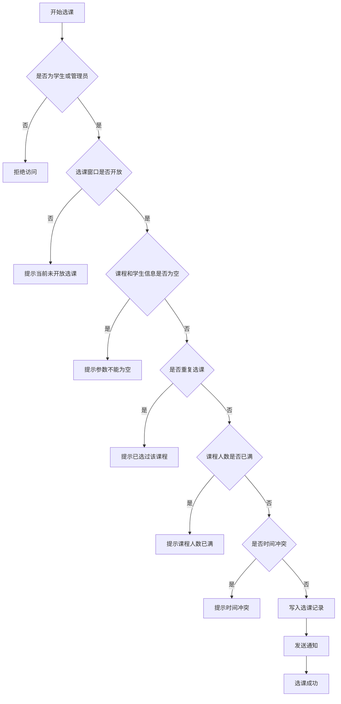

# 学生选课系统软件测试方法说明

## 1. 文档说明

本文档结合《学生选课系统》的实际业务，说明软件测试课程中常见的四类测试方法：黑盒测试、白盒测试、图覆盖测试和逻辑覆盖测试。写法尽量采用学校课程中常用的术语，既能体现测试理论，也能直接服务于课程设计、实验报告或毕业设计说明。

## 2. 被测系统概述

本系统是一个面向管理员、教师、学生三类用户的学生选课平台，主要功能包括：

- 用户登录与学生注册
- 课程信息管理
- 学生选课与退课
- 教师成绩录入
- 选课时间窗口控制
- 学生成绩与 GPA 查询
- 通知记录与审计日志管理

这些模块既包含面向用户界面的输入输出处理，也包含后端业务判断逻辑，因此适合同时采用黑盒和白盒两类方法进行测试。

## 3. 黑盒测试方法

### 3.1 黑盒测试的含义

黑盒测试把程序看成一个“黑盒子”，测试人员不关心程序内部代码如何实现，只关注输入、输出是否符合需求说明。  
学校里讲黑盒测试时，常用的方法包括：

- 等价类划分
- 边界值分析
- 错误推测法
- 判定表法

### 3.2 在本系统中的应用

#### 3.2.1 等价类划分

等价类划分就是把输入数据分成若干“有效类”和“无效类”，从每一类中选一个代表值进行测试。

以“登录功能”为例：

- 有效等价类：用户名存在、密码正确、角色正确
- 无效等价类：用户名不存在
- 无效等价类：密码错误
- 无效等价类：角色与账号类型不匹配

以“学生注册功能”为例：

- 有效等价类：用户名未重复、密码符合要求、角色为 student
- 无效等价类：用户名重复
- 无效等价类：角色为 admin 或 teacher

#### 3.2.2 边界值分析

边界值分析重点检查输入范围的临界点，因为程序错误最容易出现在边界附近。

以“课程容量”为例：

- 容量小于 0
- 容量等于 0
- 容量等于 1
- 容量等于最大允许值
- 当前选课人数等于容量上限前 1 人
- 当前选课人数刚好达到上限
- 当前选课人数超过上限

以“成绩录入”为例：

- 成绩为空
- 成绩等于 0
- 成绩等于 59
- 成绩等于 60
- 成绩等于 100
- 成绩大于 100

#### 3.2.3 错误推测法

错误推测法是根据经验去猜测系统容易出错的地方。

在本系统中，容易出错的位置包括：

- 学生重复选同一门课
- 上课时间冲突时仍被允许选课
- 未到选课时间却成功选课
- 教师修改了不属于自己课程的成绩
- 学生尝试退选其他学生的课程
- 时间窗口开始时间晚于结束时间

#### 3.2.4 判定表法

判定表法适用于多个条件共同决定结果的场景。

以“学生是否允许选课”为例，可抽象出以下条件：

- 条件 1：是否为学生角色
- 条件 2：选课窗口是否开启
- 条件 3：课程是否未满
- 条件 4：是否已经选过该课程
- 条件 5：是否存在时间冲突

若以上条件全部满足，则结果为“允许选课”；只要某一关键条件不满足，则结果为“拒绝选课并提示原因”。

### 3.3 黑盒测试示例

| 测试对象 | 输入条件 | 预期结果 |
|------|------|------|
| 登录 | 正确用户名、正确密码、正确角色 | 登录成功 |
| 登录 | 正确用户名、错误密码 | 提示账号或密码错误 |
| 注册 | 新用户名、student 角色 | 注册成功 |
| 注册 | 已存在用户名 | 提示账号已存在 |
| 选课 | 学生在开放时间内选择未满课程 | 选课成功 |
| 选课 | 学生选择已满课程 | 提示课程人数已达上限 |
| 选课 | 学生选择时间冲突课程 | 提示上课时间冲突 |
| 退课 | 学生在退课窗口内退选自己的课程 | 退课成功 |

## 4. 白盒测试方法

### 4.1 白盒测试的含义

白盒测试也称结构测试或透明盒测试。测试人员需要了解程序内部实现，根据程序中的判断、循环、路径和数据流来设计测试用例。

学校里讲白盒测试时，常见覆盖标准包括：

- 语句覆盖
- 判定覆盖（分支覆盖）
- 条件覆盖
- 路径覆盖

### 4.2 在本系统中的应用

本系统中适合做白盒测试的后端业务逻辑包括：

- `AuthService.login()`：根据角色分支执行管理员、教师、学生三种登录逻辑
- `AuthService.register()`：限制仅允许学生自助注册
- `SelectionService.create()`：先检查角色，再检查选课窗口，再校验重复选课、容量和时间冲突
- `SelectionService.delete()`：判断当前用户是否有权限退课
- `SelectionWindowService.requireOpen()`：判断窗口是否存在、是否启用、时间是否处于开放区间

### 4.3 白盒测试举例

#### 4.3.1 语句覆盖

语句覆盖要求程序中的每一条可执行语句至少执行一次。

例如对 `register()` 方法进行测试时，应至少让下列语句都被执行：

- 角色解析语句被执行
- 非学生注册时抛出异常的语句被执行
- 查询重复用户名的语句被执行
- 插入新学生数据的语句被执行

#### 4.3.2 判定覆盖

判定覆盖要求每个判断语句的真假分支都至少执行一次。

例如在 `SelectionWindowService.requireOpen()` 中，应覆盖：

- `window == null` 为真
- `window == null` 为假
- `!enabled` 为真
- `!enabled` 为假
- `now.isBefore(startTime)` 为真
- `now.isAfter(endTime)` 为真
- 时间在合法区间内的正常分支

#### 4.3.3 路径覆盖

路径覆盖要求尽可能执行程序中的不同执行路径。

以学生选课流程为例，可以设计以下典型路径：

1. 角色正确 -> 选课窗口开放 -> 课程未满 -> 无重复 -> 无冲突 -> 选课成功
2. 角色正确 -> 选课窗口未开放 -> 选课失败
3. 角色正确 -> 选课窗口开放 -> 已重复选课 -> 选课失败
4. 角色正确 -> 选课窗口开放 -> 课程人数已满 -> 选课失败
5. 角色正确 -> 选课窗口开放 -> 时间冲突 -> 选课失败

## 5. 图覆盖测试方法

### 5.1 图覆盖的含义

图覆盖测试是在白盒测试基础上，把程序流程抽象成控制流图，再根据图中的结点和边设计测试用例。

图覆盖常见标准包括：

- 结点覆盖：每个结点至少访问一次
- 边覆盖：每条边至少经过一次
- 基本路径覆盖：每条独立路径至少执行一次

### 5.2 本系统中的图覆盖对象

本系统中，最典型的图覆盖对象是“学生选课业务流程”。  
可以将其抽象为如下控制流：

### 5.3 图覆盖示例

#### 5.3.1 结点覆盖

为了达到结点覆盖，需要让上图中的每个处理结点至少被访问一次。  
例如需要设计用例分别触发：

- 拒绝访问
- 未开放选课
- 参数为空
- 重复选课
- 人数已满
- 时间冲突
- 选课成功

#### 5.3.2 边覆盖

边覆盖要求每个判断的“真”和“假”分支都要走到。  
例如：

- “是否重复选课”要分别走“是”和“否”
- “课程人数是否已满”要分别走“是”和“否”
- “是否时间冲突”要分别走“是”和“否”

#### 5.3.3 基本路径覆盖

基本路径覆盖可选取若干独立路径，例如：

- 合法选课成功路径
- 时间窗口关闭路径
- 重复选课路径
- 课程已满路径
- 时间冲突路径

这些路径组合起来，可以较全面地覆盖选课业务的核心控制流程。

## 6. 逻辑覆盖测试方法

### 6.1 逻辑覆盖的含义

逻辑覆盖主要针对程序中的布尔表达式和复合条件进行测试，重点检查逻辑表达式中各个条件取值变化时，对最终结果的影响。

学校里常讲的逻辑覆盖方式主要有：

- 判定覆盖
- 条件覆盖
- 判定/条件覆盖
- 条件组合覆盖
- 修正条件/判定覆盖（MC/DC，可作为提高要求）

### 6.2 本系统中的典型逻辑表达式

本系统里可用于逻辑覆盖的典型判断包括：

1. `window == null || !enabled`
2. `now.isBefore(startTime) || now.isAfter(endTime)`
3. `course.getMaxStudents() != null && course.getMaxStudents() > 0`
4. `score == null || score < 60`
5. `before != null && graded相同 && score相同`

这些判断都不是单一条件，而是由多个子条件组合而成，因此很适合做逻辑覆盖分析。

### 6.3 逻辑覆盖举例

#### 6.3.1 条件覆盖

条件覆盖要求复合条件中的每个基本条件至少取一次真、取一次假。

以表达式：

`window == null || !enabled`

为例，需要设计用例让：

- `window == null` 为真和假都出现
- `!enabled` 为真和假都出现

#### 6.3.2 判定/条件覆盖

判定/条件覆盖要求：

- 整个判定表达式结果至少为真和假各一次
- 每个基本条件至少取真和假各一次

例如对：

`now.isBefore(startTime) || now.isAfter(endTime)`

可设计三组数据：

- 当前时间早于开始时间
- 当前时间晚于结束时间
- 当前时间处于开始和结束之间

这样既能覆盖各条件真假，也能覆盖整个判定的真假结果。

#### 6.3.3 条件组合覆盖

条件组合覆盖要求列出各基本条件可能的组合，并尽量让每一种组合至少执行一次。

以“是否允许选课”为例，若选取三个基本条件：

- A：时间窗口已开放
- B：课程未满
- C：无时间冲突

则理论上可形成 8 种组合：

| A | B | C | 预期结果 |
|------|------|------|------|
| T | T | T | 允许选课 |
| T | T | F | 不允许 |
| T | F | T | 不允许 |
| T | F | F | 不允许 |
| F | T | T | 不允许 |
| F | T | F | 不允许 |
| F | F | T | 不允许 |
| F | F | F | 不允许 |

#### 6.3.4 MC/DC 思想

如果按照更高要求进行测试，可以采用 MC/DC，即让每个基本条件都能“独立影响”最终判定结果。  
这种方法比普通条件覆盖更严格，常用于对可靠性要求较高的软件测试分析，在课程报告中写出来也更完整。

## 7. 适合本系统的测试组织方式

结合本项目特点，比较适合采用如下组合方式：

- 对前端页面输入、接口返回和业务功能使用黑盒测试
- 对后端服务层关键方法使用白盒测试
- 对选课、退课、窗口控制等流程使用图覆盖测试
- 对复合判断条件较多的方法使用逻辑覆盖测试

也就是说，本系统不适合只使用单一测试方式，而是更适合“功能测试 + 结构测试 + 流程测试 + 逻辑测试”结合使用。

## 8. 总结

黑盒测试强调“功能是否正确”，白盒测试强调“内部结构是否被充分检查”，图覆盖强调“控制流程是否被覆盖”，逻辑覆盖强调“复合条件是否被验证”。  
对于学生选课系统这类管理信息系统来说，这四类方法相互补充，既能验证用户能否正确完成登录、选课、查询等操作，也能检查程序内部在权限控制、时间窗口、课程容量、成绩判定等关键逻辑上的正确性。

因此，在课程设计或软件测试实验中，将这四类方法结合起来描述和使用，会更符合学校教学中的测试分析要求。
